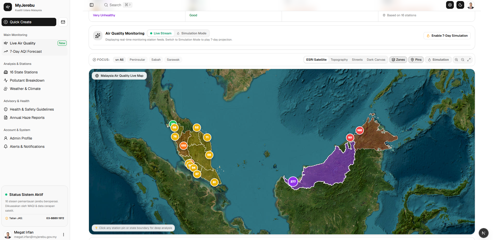
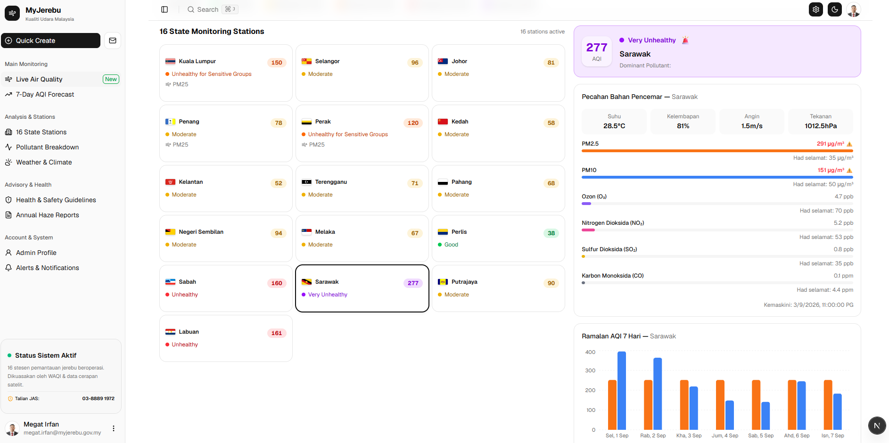

# 🌫️ MyJerebu — Malaysia Air Quality & Haze Monitoring Portal

[](https://nextjs.org/)
[](https://react.dev/)
[](https://www.typescriptlang.org/)
[](https://tailwindcss.com/)
[](https://leafletjs.com/)
[](https://opensource.org/licenses/MIT)

**MyJerebu** is an advanced, real-time air quality monitoring and transboundary haze simulation platform for Malaysia. Built with Next.js 16, React 19, Leaflet GIS mapping, and WAQI telemetry, MyJerebu provides public health intelligence, particulate pollution analytics, and 7-day meteorological forecasts across all 16 Malaysian states and federal territories.

---

## 📸 Screenshots

<p align="center">
  
  <em align="center">Interactive ESRI Satellite GIS Air Quality Map with 16 State Monitoring Station pins and regional boundaries.</em>
</p>

<br />

<p align="center">
  
  <em align="center">16 Malaysian State Stations Grid with official state flags, 6 Pollutant Breakdown meters, and 7-Day AQI Forecast chart.</em>
</p>

---

## 🌟 Key Features

### 1. 🗺️ Interactive GIS Air Quality Map & Satellite Telemetry
- **Interactive Leaflet Map**: Switch seamlessly between **ESRI Satellite Imagery**, **Topography**, **Street Maps**, and **Dark Canvas**.
- **16 Malaysian State Stations**: High-precision interactive map pins and boundaries for all states with dynamic Air Quality Index (AQI/IPU) color codes.
- **Regional Focus Controls**: Instant zoom focus buttons for Peninsular Malaysia, Sabah, and Sarawak.
- **Custom SVG State Flags**: Integrated official flag icons for all 13 states and 3 federal territories.

### 2. 🔥 7-Day Transboundary Haze Simulation & Wind Dynamics
- **Live Stream vs. Simulation Toggle**: Clean switch between live real-time feeds and 7-day haze playback.
- **Organic Smoke Shader Overlay**: Realistic visual smoke plumes and moving wind trajectory streamlines.
- **Sumatera & Kalimantan Fire Hotspots**: Animated pulsing radar markers on active peatland fire clusters.
- **Timeline Player**: Play/pause, step navigation, 1x/2x/3x playback speeds, and meteorological HUD showing daily impact levels.

### 3. 📊 16 State Monitoring Stations Directory
- Comprehensive telemetry grid and table views with search and filtering by region (*Peninsular*, *East Malaysia*) and status (*Good*, *Moderate*, *Unhealthy*, *Hazardous*).
- Instant **CSV Export** for station telemetry data.

### 4. 🔬 In-Depth Pollutant Analysis (PM2.5, PM10, O₃, NO₂, SO₂, CO)
- Deep breakdown of 6 critical atmospheric pollutants with WHO 24-hour guidelines and DOE National Thresholds.
- State-by-state comparative concentration meters with automated exceedance badges.

### 5. 🌦️ 7-Day AQI Forecast & Meteorological Weather Analytics
- ECMWF/CAMS atmospheric model trajectory projections for all 16 states.
- Real-time temperature, humidity, wind speed, and barometric pressure observations.

### 6. 🛡️ Health Advisory & School Closure Matrix
- Interactive AQI Health Simulator slider (0–350+ AQI).
- Official Ministry of Health (MOH) and Department of Environment (DOE) guidelines for general public, high-risk groups, school protocols, and N95 mask recommendations.

### 7. 📑 Official Haze Reports & Scientific Archive
- Filterable archive of annual environmental reports, quarterly summaries, and transboundary haze crisis whitepapers.

### 8. 🚨 Haze Alerts & Notification Center
- Automated dispatch rules via Email, SMS, and Telegram Bot for active threshold breaches.
- Quick links to DOE complaint hotlines (1-800-88-2727) and BOMBA emergency rescue.

### 9. 🔐 Split-Screen Admin Login Portal (`/login`)
- Dedicated login portal with live national telemetry stats and 1-click demo access for **Megat Irfan (Lead Administrator)** and **DOE Research Officer**.

---

## 🛠️ Technology Stack

- **Framework**: [Next.js 16](https://nextjs.org/) (App Router, Server & Client Components)
- **Library**: [React 19](https://react.dev/)
- **Language**: [TypeScript](https://www.typescriptlang.org/) (Strict Mode)
- **Styling**: [Tailwind CSS v4](https://tailwindcss.com/)
- **UI & Icons**: [shadcn/ui](https://ui.shadcn.com/) (`radix-nova`), [Lucide React](https://lucide.dev/)
- **Mapping & GIS**: [Leaflet](https://leafletjs.com/), ESRI ArcGIS Tile Servers, GeoJSON State Boundaries
- **Charts & Visuals**: [Recharts](https://recharts.org/)
- **Data Source**: [World Air Quality Index (WAQI) Project API](https://waqi.info/) & DOE Telemetry

---

## 🚀 Getting Started

### Prerequisites
- [Node.js](https://nodejs.org/) (v18.18 or higher)
- `npm` or `pnpm`

### Installation

1. **Clone the repository**:
   ```bash
   git clone https://github.com/MegatIrfan/myjerebu.git
   cd myjerebu
   ```

2. **Install dependencies**:
   ```bash
   npm install
   ```

3. **Set up Environment Variables (Optional)**:
   Create a `.env.local` file in the root directory:
   ```env
   NEXT_PUBLIC_WAQI_TOKEN=your_waqi_api_token_here
   ```

4. **Run the development server**:
   ```bash
   npm run dev
   ```

5. **Open the application**:
   Open [http://localhost:3000](http://localhost:3000) in your browser.

---

## 📁 Project Structure

```
myjerebu/
├── media/                   # Showcase screenshots for repository documentation
├── public/
│   └── flags/1x2/           # Official Malaysian state flag SVGs
├── src/
│   ├── app/
│   │   ├── (main)/dashboard/
│   │   │   ├── air-quality/ # Interactive Leaflet map & Haze simulation
│   │   │   ├── stations/    # 16 State monitoring directory & CSV export
│   │   │   ├── pollutants/  # 6 Pollutant breakdowns & WHO standards
│   │   │   ├── forecast/    # 7-Day ECMWF AQI projections
│   │   │   ├── weather/     # Temperature, humidity & barometric climate
│   │   │   ├── advisory/    # Health guidelines & interactive simulator
│   │   │   ├── reports/     # Official annual & haze report archives
│   │   │   ├── alerts/      # Notification triggers & emergency hotlines
│   │   │   └── profile/     # Admin user profile management
│   │   ├── login/           # Split-screen branded authentication portal
│   │   └── api/             # Telemetry refresh API endpoints
│   ├── components/ui/       # shadcn/ui components
│   └── navigation/          # Sidebar navigation config
└── README.md
```

---

## 👤 Author & Maintainer

**Megat Irfan**
- GitHub: [@MegatIrfan](https://github.com/MegatIrfan)
- Repository: [https://github.com/MegatIrfan/myjerebu](https://github.com/MegatIrfan/myjerebu)

---

## 📄 License

This project is licensed under the [MIT License](LICENSE).
