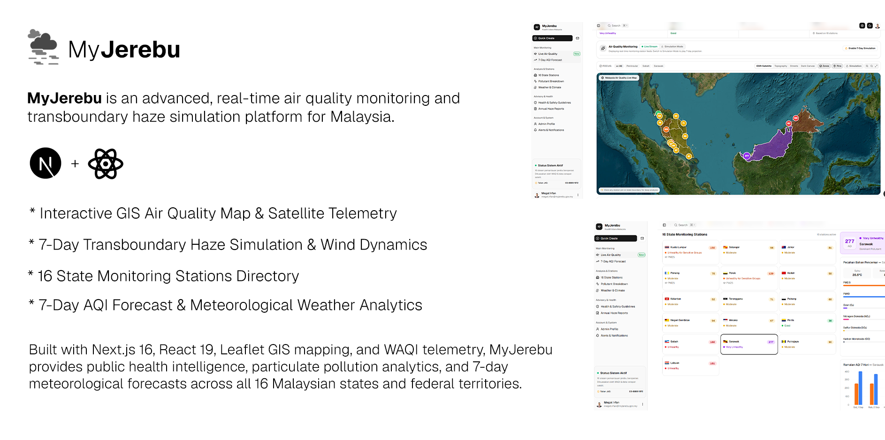

<div align="center">



<br /><br />

# MyJerebu — Air Quality & Transboundary Haze Intelligence

**A high-precision real-time atmospheric telemetry and 7-day haze simulation portal for Malaysia.**

[](https://nextjs.org/)
[](https://react.dev/)
[](https://www.typescriptlang.org/)
[](https://tailwindcss.com/)
[](https://leafletjs.com/)
[](LICENSE)

<br />

<p align="center">
  <a href="#-overview">Overview</a> •
  <a href="#-key-features">Features</a> •
  <a href="#-system-architecture">Architecture</a> •
  <a href="#-tech-stack">Tech Stack</a> •
  <a href="#-getting-started">Quickstart</a> •
  <a href="#-author">Author</a>
</p>

</div>

---

## 🛰️ Overview

**MyJerebu** is an enterprise-grade environmental monitoring platform built to deliver transparent, actionable air pollution telemetry across Malaysia. Powered by live sensor feeds from the **World Air Quality Index (WAQI)** and satellite observation models, MyJerebu transforms complex atmospheric data into intuitive spatial maps, particulate breakdowns, meteorological trend forecasts, and actionable public health advisories.

<br />

<div align="center">
  
  <p><em>Interactive ESRI Satellite GIS Viewport with 16 State Monitoring Station Telemetry Pins</em></p>
</div>

<br />

<div align="center">
  
  <p><em>16 State Stations Grid, 6 Pollutant Breakdown Meters, and 7-Day AQI Forecast Chart</em></p>
</div>

---

## ✨ Key Capabilities

<table>
  <tr>
    <td width="50%" valign="top">
      <h3>🗺️ Dynamic Leaflet GIS Mapping</h3>
      <ul>
        <li><b>Multiple Basemaps:</b> Seamless toggle between ESRI Satellite, Topography, Street Maps, and Dark Canvas.</li>
        <li><b>16 State Pinpoint Sensors:</b> Dynamic color-coded AQI pins and boundary polygons for all 13 states & 3 federal territories.</li>
        <li><b>Region Focus Controls:</b> 1-click smooth zoom for Peninsular Malaysia, Sabah, and Sarawak.</li>
      </ul>
    </td>
    <td width="50%" valign="top">
      <h3>🔥 7-Day Haze Simulation Mode</h3>
      <ul>
        <li><b>Mode Switch:</b> Instant toggle between Live Telemetry and 7-Day Haze Playback.</li>
        <li><b>Organic Smoke Overlay:</b> Animated GPU smoke shader and monsoon wind trajectory streamlines.</li>
        <li><b>Hotspot Radar:</b> Live fire cluster indicators across Sumatra and Kalimantan peatlands.</li>
      </ul>
    </td>
  </tr>
  <tr>
    <td width="50%" valign="top">
      <h3>🔬 6-Pollutant Granular Analysis</h3>
      <ul>
        <li><b>Pollutant Dossiers:</b> In-depth metrics for <code>PM2.5</code>, <code>PM10</code>, <code>O₃</code>, <code>NO₂</code>, <code>SO₂</code>, and <code>CO</code>.</li>
        <li><b>WHO & DOE Benchmarks:</b> Real-time compliance comparison against national safe thresholds and WHO 24-hr guidelines.</li>
      </ul>
    </td>
    <td width="50%" valign="top">
      <h3>🌦️ 7-Day Predictive AQI Forecasting</h3>
      <ul>
        <li><b>ECMWF / CAMS Models:</b> 7-day particulate movement projections for every state.</li>
        <li><b>Meteorological Feed:</b> Ambient temperature, relative humidity, wind velocity, and barometric pressure.</li>
      </ul>
    </td>
  </tr>
  <tr>
    <td width="50%" valign="top">
      <h3>🛡️ Public Health & School Closure Matrix</h3>
      <ul>
        <li><b>Interactive Simulator:</b> Drag-and-drop AQI health risk slider (0 to 350+ AQI).</li>
        <li><b>MOH & DOE Protocols:</b> Tailored advisories for general public, vulnerable groups, and automatic school closure triggers.</li>
      </ul>
    </td>
    <td width="50%" valign="top">
      <h3>🔐 Executive Split-Screen Authentication</h3>
      <ul>
        <li><b>Dedicated Login Portal:</b> Branded <code>/login</code> screen with live national air quality telemetry ticker.</li>
        <li><b>Quick-Fill Demo:</b> 1-click instant login for Lead Administrator and DOE Research Officer.</li>
      </ul>
    </td>
  </tr>
</table>

---

## 📐 System Architecture

```
myjerebu/
├── 📁 media/                    # Showcase screenshots & brand assets
├── 📁 public/
│   └── 📁 flags/1x2/           # Vector SVGs for all 16 Malaysian state flags
├── 📁 src/
│   ├── 📁 app/
│   │   ├── 📁 (main)/dashboard/
│   │   │   ├── 📁 air-quality/ # Leaflet GIS map, smoke shader & haze player
│   │   │   ├── 📁 stations/    # 16 State stations directory & CSV export
│   │   │   ├── 📁 pollutants/  # 6 Pollutant meters & WHO benchmark cards
│   │   │   ├── 📁 forecast/    # 7-Day ECMWF AQI trajectory projections
│   │   │   ├── 📁 weather/     # Temperature, humidity & barometric climate
│   │   │   ├── 📁 advisory/    # Health matrix & interactive slider simulator
│   │   │   ├── 📁 reports/     # Official annual & haze report archives
│   │   │   ├── 📁 alerts/      # Automated alert dispatch & emergency hotlines
│   │   │   └── 📁 profile/     # Administrator profile settings
│   │   ├── 📁 login/           # Split-screen branded authentication portal
│   │   └── 📁 api/             # Telemetry cache refresh endpoints
│   ├── 📁 components/ui/       # Radix Nova styled shadcn/ui components
│   └── 📁 navigation/          # Dynamic dashboard sidebar configuration
└── 📄 README.md
```

---

## 🛠️ Tech Stack & Dependencies

| Category | Technologies |
| :--- | :--- |
| **Core Framework** | [Next.js 16](https://nextjs.org/) (App Router, Server Actions, React Server Components) |
| **UI Library** | [React 19](https://react.dev/), [TypeScript 5](https://www.typescriptlang.org/) |
| **Styling** | [Tailwind CSS v4](https://tailwindcss.com/), [Geist Sans Font](https://vercel.com/font) |
| **UI Primitives** | [shadcn/ui](https://ui.shadcn.com/) (`radix-nova`), [Lucide React](https://lucide.dev/) |
| **Mapping & GIS** | [Leaflet](https://leafletjs.com/), ESRI World Imagery Tile Servers, GeoJSON Boundaries |
| **Data Visuals** | [Recharts](https://recharts.org/) |
| **Telemetry Source** | [WAQI Open Air Quality API](https://waqi.info/), DOE Malaysia Station Feeds |

---

## ⚡ Quickstart

### 1. Clone the repository
```bash
git clone https://github.com/MegatIrfan/myjerebu.git
cd myjerebu
```

### 2. Install dependencies
```bash
npm install
```

### 3. Configure environment variables *(optional)*
Create `.env.local` in your root folder:
```env
NEXT_PUBLIC_WAQI_TOKEN=your_waqi_api_token
```

### 4. Run the development server
```bash
npm run dev
```

Open [http://localhost:3000](http://localhost:3000) with your browser to experience the dashboard.

---

## 👤 Author & Maintainer

<div align="center">

### **Megat Irfan**
*Lead Administrator & Software Engineer*

[](https://github.com/MegatIrfan)
[](https://github.com/MegatIrfan/myjerebu)

</div>

---

<div align="center">
  <sub>Built with ❤️ for public environmental awareness in Malaysia. Released under the MIT License.</sub>
</div>
